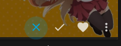
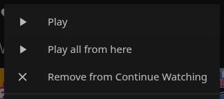
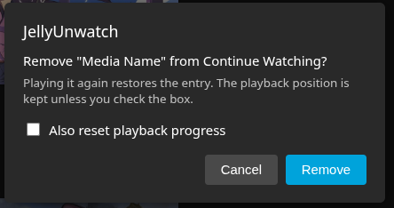

JellyUnwatch
====================
## About
Jellyfin has no way to take a title out of Continue Watching or Next Up. Marking it played or clearing its resume point both lose where you stopped.

This plugin keeps a hidden list per user on the server. Entries on that list are dropped from the resume and next up responses, while the playback position stays in the database, so resuming still works and playing the title again brings the entry back.

The button for removing something is added to these clients:
* [Jellyfin Web Client](https://github.com/jellyfin/jellyfin-web)
* [Jellyfin Media Player](https://github.com/jellyfin/jellyfin-media-player) (JMP) Desktop Client, which loads the same web client from the server

The filtering itself runs on the server, so other clients get the cleaned up rows too, they just have no button and can use the API instead.

Early version, tested against Jellyfin 12.0 on a single setup.

## Features
* Take a single item out of Continue Watching or out of Next Up
* Playback position survives, so resuming still works
* Optional checkbox in the confirmation dialog for clearing the position anyway
* Removing an episode keeps its show out of Next Up until you play something from it
* Shift click or long press removes the whole show at once
* Playing a title again puts it back
* Button on the card overlay and an entry in the card context menu
* Configuration page lists the hidden entries per user with a restore button
* Styling follows the existing card buttons, so custom skins keep working

## Preview


The button sits with the other card buttons and shows up on hover.



Cards in the Next Up row read `Remove from Next Up` instead.



The checkbox only appears while `Allow user to reset playback progress` is on.

## Installation

### Jellyfin Web Client (Server)

> [!NOTE]
> This plugin targets Jellyfin 12.0. Builds for 10.x will not load.

> [!IMPORTANT]
> [file-transformation](https://github.com/IAmParadox27/jellyfin-plugin-file-transformation) v3.0.0.0 or newer is needed for the button. It hands the client script to the browser without editing `index.html` on disk, which avoids file ownership trouble on any kind of installation. Without it the API and the server side filtering still work.

<details open>
<summary> See instructions... </summary>

1. Add the manifest `https://raw.githubusercontent.com/fthomys/jellyunwatch/main/manifest.json` as a Jellyfin plugin repository to your server.
2. Install the plugin `JellyUnwatch` from the repository.
3. Install [file-transformation](https://github.com/IAmParadox27/jellyfin-plugin-file-transformation) if it is not on the server yet.
4. Restart the Jellyfin server.
5. Load the web client once with `Ctrl` `Shift` `R`, so the browser drops the old scripts.
</details>

### Manual installation
<details>
<summary> See instructions... </summary>

1. Download the archive from the [releases](https://github.com/fthomys/jellyunwatch/releases).
2. Unpack it into `JellyUnwatch_<version>` inside the plugin directory, for example `/var/lib/jellyfin/plugins/JellyUnwatch_1.0.0.0`, or `/config/plugins/JellyUnwatch_1.0.0.0` in a container.
3. Give the files to the account Jellyfin runs under.
4. Restart the Jellyfin server.
</details>

### Building from source
<details>
<summary> See instructions... </summary>

The .NET 10 SDK is required.

```
dotnet build -c Release
./build/package.sh
```

The archive and its `meta.json` end up in `bin/jelly-unwatch_<version>.zip`.

For a test server, `tools/testinstall.sh` uploads that archive, unpacks it, deletes the archive and restarts the container:

```
tools/testinstall.sh user@host
```

Paths and container names come from `PLUGIN_ROOT`, `CONTAINER` and `OWNER`, either as environment variables or in `tools/testinstall.env`. `tools/testinstall.sh --help` lists all of them.
</details>

## Configuration
Dashboard, Plugins, JellyUnwatch.

| Setting | Default | Effect |
|---|---|---|
| Show the remove button in the web client | on | Registers the script injection with file-transformation |
| Also hide the series from Next Up | on | Keeps the whole show out of Next Up until you play something from it |
| Clear the resume position when hiding | off | Server default for clearing the position |
| Allow user to reset playback progress | on | Puts the reset checkbox into the confirmation dialog |
| Restore an item when it is played again | on | Drops the entry from the hidden list on playback start |
| Ask for confirmation before hiding | on | Shows the confirmation dialog |

### API
Other clients can drive the plugin over HTTP with a regular user token.

| Route | Purpose |
|---|---|
| `GET /JellyUnwatch/Items` | Hidden entries of the calling user |
| `POST /JellyUnwatch/Items/{itemId}?scope=Item\|Series&clearResume=true\|false` | Hide one item, or the show it belongs to |
| `DELETE /JellyUnwatch/Items/{itemId}` | Put it back |
| `GET /JellyUnwatch/ClientOptions` | Settings the injected script reads |

Administrator accounts also get `GET /JellyUnwatch/Users`, `DELETE /JellyUnwatch/Users/{userId}/Items/{itemId}` and `DELETE /JellyUnwatch/Users/{userId}/Items`.

### Stored data
The settings above apply to the whole server, the hidden lists belong to each user. Both live in the Jellyfin config directory, `/config` in most containers:

| Path | Contents |
|---|---|
| `plugins/Jellyfin.Plugin.JellyUnwatch/hidden-items.json` | Hidden entries per user, with item id, series id, name and timestamp |
| `plugins/configurations/Jellyfin.Plugin.JellyUnwatch.xml` | The settings from the configuration page |

Removing the plugin leaves both files behind, so an entry hidden today is still hidden after a reinstall. To get the rows back before uninstalling, restore the entries on the configuration page, or delete `hidden-items.json` while the server is stopped.

## Known limitations
* Only the resume and next up endpoints are filtered, `/UserItems/Resume`, `/Users/{userId}/Items/Resume` and `/Shows/NextUp`. A client that builds its own list from other endpoints keeps showing everything.
* The follow up check in the browser compares item ids. After hiding a whole show, the other episodes of it disappear once the server answers again, not while the client is still drawing from its cache.
* The button needs the card overlay of the desktop layout. On the TV layout Jellyfin renders no hover menu, so it falls back to a floating button, which is untested there.
* Without file-transformation there is no button at all. The API and the filtering are unaffected.
* Removing the plugin does not put anything back on its own, see the section above.

## Troubleshooting

### 1. The remove button isn't visible
<details>
<summary> See a list of possible solutions... </summary>

#### 1.1 Check that file-transformation is installed
Without it nothing gets injected, and the server log says so during startup:
```
JellyUnwatch.PluginEntryPoint: File Transformation was not found. The API and the server side filtering work, but the web button is unavailable.
```

#### 1.2 Reload the client properly
The browser keeps the old script until you reload with `Ctrl` `Shift` `R`. Do that after every plugin update.

#### 1.3 Check the injection
The first command has to print a script tag, the second one has to print `200`:
```
curl -s https://your-server/web/index.html | grep JellyUnwatch
curl -s -o /dev/null -w "%{http_code}\n" https://your-server/JellyUnwatch/ClientScript.js
```

#### 1.4 Check the setting
`Show the remove button in the web client` turns the injection off completely.
</details>

### 2. A removed entry is back
<details>
<summary> See a list of possible solutions... </summary>

#### 2.1 It was played again
With `Restore an item when it is played again` enabled, playback start clears the entry. Every restore records where it came from:
```
JellyUnwatch.Services.HiddenItemStore: Restored item <id> for user <id>, source: playback start, client Jellyfin Web, device Chrome, automated False
```

#### 2.2 It was restored on the configuration page
The same log line then reads `source: admin page`.

#### 2.3 The client redrew an old row
The web client rebuilds its rows from an in memory cache and sometimes skips the server. The script compares each card against the hidden list and takes it out again, with a note in the browser console:
```
[JellyUnwatch] Removed a re-rendered card for hidden item <id>
```
If the entry survives a hard refresh, it really came from the server. The plugin log line starting with `Filter reached` shows which endpoint returned it and which ids came back.
</details>

<br/>
<br/>
If you run into an error you can't fix yourself, open an issue.
<br/>Setups differ a lot, so put as much detail about yours into the report as you can.
<br/>Jellyfin logs and browser console output, prefixed with [JellyUnwatch], help the most.

## Credits
The script injection runs through [file-transformation](https://github.com/IAmParadox27/jellyfin-plugin-file-transformation) by [IAmParadox27](https://github.com/IAmParadox27), which grew out of a [pull request](https://github.com/jellyfin/jellyfin/pull/9095) by [JPVenson](https://github.com/JPVenson).
<br/>Hiding entries instead of resetting their progress is the idea behind [jellyfin-plugin-discontinue-watching](https://github.com/jon4hz/jellyfin-plugin-discontinue-watching) by [jon4hz](https://github.com/jon4hz).
<br/>The layout of this readme follows [InPlayerEpisodePreview](https://github.com/Namo2/InPlayerEpisodePreview) by [Namo2](https://github.com/Namo2).

## License
MIT, see [LICENSE](LICENSE).

## Disclaimer
Parts of this project were written with the help of AI.
